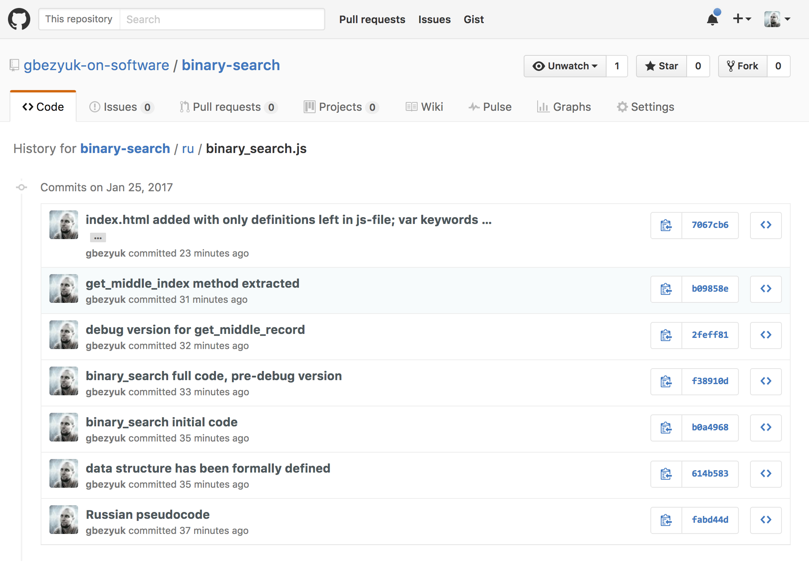

# Задача двоичного поиска

Этот репозиторий дополняет [статью о двоичном поиске](https://github.com/gbezyuk-on-software/computer-science-and-software-development-for-newbies/blob/master/texts/2.md)

## Введение

После реализации алгоритма и его отладки в консоли, мы решили сохранить наши результаты в файл,
ибо большие проекты в консоли ковырять ну очень неудобно, а планы у нас — наполеоновские.

Это — прекрасный повод и вполне достаточная причина для того, чтобы освоить работу с системой версионирования Git и сервисом GitHub.

## Файлы исходного кода и история их изменения

### О хранении кода в файлах

Исходный код программы на любом языке программирования, не исключая JavaScript, удобно хранить в файлах с расширением `.js`.
Например, код функций, необходимых для решения задачи двоичного поиска мы сохранили в файле [`binary_search.js`](./binary_search.js).
Файл — это всего лишь именованная последовательность байтов, хранимая на каком-нибудь носителе, и имеющая некий адрес.

### О подключении JavaScript в HTML

Наш файл `binary search`, в принципе, можно использовать просто как место для сохранения результатов работы: копировать оттуда код,
вручную вставлять его в консоль, запускать... Можно, но затея эта, прямо скажем, не очень. Лучше воспользоваться существующей возможсностью
встраивать JavaScript в HTML-файлы:

```html
<!DOCTYPE html>
<html>
    <!-- где-то внутри документа -->
    <script type="text/javascript" src="./путь/к/файлу.js"></script>
    <!-- и дальше HTML -->
</html>
```

А ещё можно писать код на JS прямо в HTML-файлах:

```html
<!DOCTYPE html>
<html>
    <!-- где-то внутри документа -->
    <script type="text/javascript">
        console.log('я запущусь отсюда! я обязательно запущусь!')
    </script>
    <!-- и дальше HTML -->
</html>
```

Эти две возможности можно прекрасно совмещать. В нашем случае, мы вынесли определения функций в отдельный файл,
а определения данных, запуск и вспомогательную информацию — встроили прямо в HTML. Получился файл [`index.html`](./index.html):

```html
<!DOCTYPE html>
<html>
<head>
    <script type="text/javascript" src="./binary_search.js"></script>    
</head>
<body>
    <h1>Двоичный поиск</h1>
    
    <p>Пожалуйста, откройте консоль разработчика</p>
    
    <script type="text/javascript">
        var phonebook = [
          ["Абалаев Иван", "111-11-11"],        // элемент списка №0 
          ["Баранов Сергей", "222-11-11"],      // элемент списка №1
          ["Волкова Ольга", "333-11-11"],       // элемент списка №2
          ["Громов Пётр", "444-11-11"],         // элемент списка №3
          ["Добрая Анна", "555-11-11"],         // элемент списка №4
          ["Ежова Елизавета", "666-11-11"]      // элемент списка №5
        ];

        var lookup_person = "Добрая Анна";

        console.log("Используем телефонную книгу", phonebook);

        console.log("Ищем", lookup_person);

        console.log("Результат поиска", binary_search(phonebook, lookup_person));
    </script>
</body>
</html>
```

Таким образом, у нас получилось небольшое клиентское веб-приложение из двух файлов.

### Изменения в файлах и их учёт

Работа программиста — это размышления, результаты которых находят своё отражение в изменении файлов исходного кода.
Уметь отследить изменения — значит, в первом приближении, уметь отследить ход мысли программиста.

Git и GitHub позволяют нам сохранить и в любой момент просмотреть историю изменений файлов.
Не будем пока углубляться в тонкости того, как это работает, а просто взглянем на
[историю изменений файла `binary_search.js`](https://github.com/gbezyuk-on-software/binary-search/commits/master/ru/binary_search.js):



Мы видим, что были залогированы несколько шагов изменения (в Git эти шаги называются "коммитами", от англ. "to commit", "совершить что-то").
Для каждого шага мы можем увидеть, что именно было изменено. Например, на [вот этом шаге](https://github.com/gbezyuk-on-software/binary-search/commit/b09858e0a7cd144a8127ec4176c0870a95b3b849) был выделен метод `get_middle_index`, а из метода `get_middle_record` были удалены отладочные вызовы.

Некоторые коммиты затрагивают сразу несколько файлов. Всю историю коммитов этого репозитория (хранилища кода) можно просмотреть [здесь](https://github.com/gbezyuk-on-software/binary-search/commits/master). Вы даже можете найти, в какой момент я добавил в репозиторий непосредственно эту строку текста.
